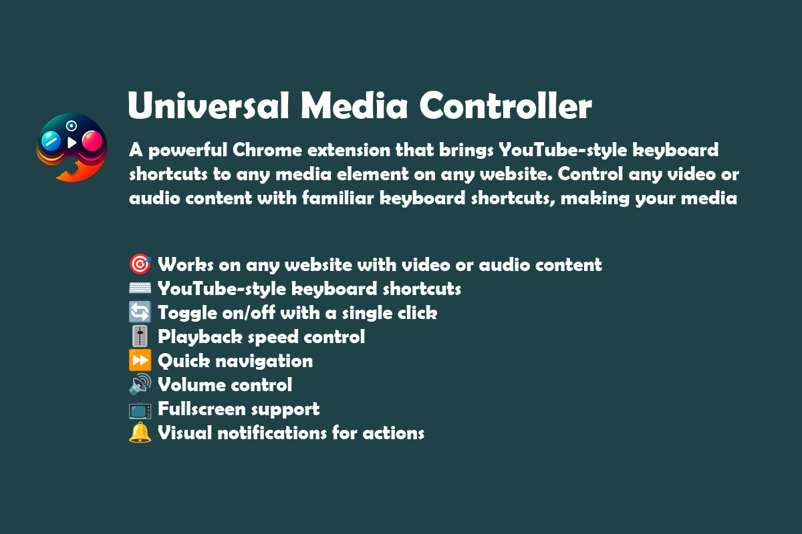

# Universal Media Controller



YouTube-style keyboard shortcuts for any `<video>` or `<audio>` element on the web. You choose which sites to allow — the extension does not request broad website access at install time.

## Features

- Works on sites with HTML5 video/audio (including many iframe players)
- Familiar YouTube-style shortcuts
- **Optional site access** — allow the current site, or all sites, from the popup
- Custom shortcuts — remap or disable any action
- **Site profiles** — auto-disable conflicting keys on Twitch, Netflix, and custom domains
- Site blacklist (domain or regex)
- Playback speed, seek, volume, mute, fullscreen, PiP
- Subtitle cue jump (where `textTracks` are available)
- Toggle on/off from the popup (applies to allowed tabs)
- Settings stored locally — no accounts, no analytics

## Keyboard Shortcuts (defaults)

| Key | Function |
|-----|----------|
| K | Play / Pause |
| J / L | Seek −10s / +10s |
| ← / → | Seek −5s / +5s |
| `<` / `>` | Speed −0.25× / +0.25× |
| 0–9 | Jump to 0%–90% |
| M | Mute |
| F | Fullscreen |
| P | Picture-in-Picture |
| + / − | Volume ±10% |
| [ / ] | Previous / next subtitle |

Remap, disable, or override per site under **Shortcuts & site profiles**.

## Installation

### Chrome Web Store

[**Universal Media Controller** on the Chrome Web Store](https://chromewebstore.google.com/detail/gfnimohgkhpemnhidffilknnibppmfkg)

After install, open the popup on a video page and click **Allow this site** (or **Allow all sites**).

### Manual / development install

1. Download the latest release from [Releases](https://github.com/mostafaafrouzi/Universal-Media-Controller/releases), or clone this repo
2. Open `chrome://extensions/` and enable **Developer mode**
3. Click **Load unpacked** and select the extension folder
4. Open the popup → **Allow this site** or **Allow all sites**

## Development

```bash
git clone https://github.com/mostafaafrouzi/Universal-Media-Controller.git
cd Universal-Media-Controller
npm test        # sanity checks
npm run build   # creates releases/universal-media-controller.zip
```

## Permissions & privacy

| Permission | When |
|------------|------|
| `storage` | Always — save preferences |
| `activeTab` / `scripting` | Always — inject hotkeys when you use the popup or after you grant a site |
| Host access | **Optional** — only after you click Allow in the popup |

Chrome may still warn when you choose **Allow all sites**; that prompt is user-initiated, not forced at install. See [PRIVACY.md](PRIVACY.md).

## Tips

- Twitch / Netflix / YouTube: optional site profiles in Options can disable clashing keys — off by default.
- If keys clash elsewhere, disable those actions globally or add a custom site profile.
- After granting a new site, reload the tab if shortcuts do not appear yet.
- Some DRM / fully custom players do not expose a standard media element.

## Contributing

See [CONTRIBUTING.md](CONTRIBUTING.md). Bug reports welcome via [Issues](https://github.com/mostafaafrouzi/Universal-Media-Controller/issues).

## License

MIT — see [LICENSE](LICENSE).

## Acknowledgments

Inspired by [@jiangts/media-hotkeys](https://github.com/jiangts/media-hotkeys).

## Changelog

See [CHANGELOG.md](CHANGELOG.md).
